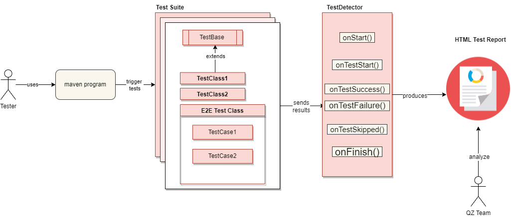
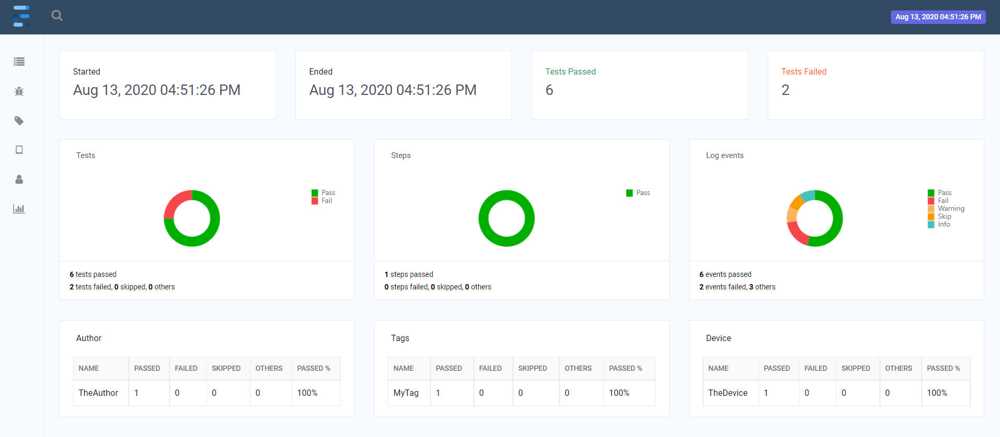

# UI Test Automation Framework
Production ready UI Test Automation Framework based on Selenium WebDriver and TestNG. 

I would be happy to show you the framework in detail, feel free to contact me for a demo!

## Dependencies 
This project depends on the following external libraries. 

* **selenium-java** : browser automation codes
* **webdrivermanager** : managing driver executables through code
* **testng** : creating and managing test cases
* **extentreport** : generating HTML based test execution report
* **javafaker** : generating randomized test data in real time


## Framework Project Structure
```text
|-reports            # contains test report generated
|-src 
  |- test
       |- java
            |-[+]base   # all the parent classed are organized here
            |-[+]pages  # all the page object classed are organized here
            |-[+]tests  # all the test classes are organized here
            |-[+]utils  # all the commonly used classed are organized here
|-gitignore             # add git ignore file config here
|-pom.xml               # maven project config file
```

## Pre-requisites
* Download and install Chrome, Firefox, and Edge browser
* Download and install [JDK v1.8+]()
* Download and install [Apache Maven v3.0+]()
* Download and install [Git v2.0]()

## Internal Framework Structures
This is a diagram that details the internal structure of this framework.


## How to Run Test
All the test triggering id conducted by **mvm** command, this framework supports test execution by multiple different browsers as seen below.

#### Supported Browsers
| Browser | Maven Options |
|---------|---------------|
|Chrome   | `-Dbrowser=chrome`|
|Firefox  | `-Dbrowser=firefox`|
|MS Edge  | `-Dbrowser=edge`|
|Headless |` -Dbrowser=headless`|

To trigger all the test case execution:
```shell
mvn test
```

To trigger all the test grouped as smoke:
```shell
mvn test -Dgroups=smoke
```

To trigger all or specified test with desired browser
```shell
mvn test -Dbrowser=chrome
mvn test -Dbrowser=chrome -Dgroups=smoke
```

## How to View Report
All the test executions reports will be saved on the reports folder.
```text
|-reports
    |-Index.html
```
Please navigate to this folder to view the test execution result, sample ExtentReport will look like this with more test cases. [Reference ](https://www.extentreports.com/docs/v5/wiki/spark/spark.html#)

